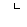
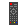

# watch2

Software and Hardware for my custom smartwatch

The system is built on an ESP32, and uses software written using the ESP-IDF (with the ESP32 Arduino Core as a component).  The system contains a few pre-built "apps".

|  Watch Face            |  Settings           |  Calculator       | Stopwatch          |
|---------------------------------------------------|---------------------------------------------------|---------------------------------------------------|---------------------------------------------------|
|  Timer                 |  Alarms               |  File Browser   |  Notepad (read only) |
|  IR Remote         |  Image Viewer   |  Weather             |  Wikipedia         |
|  Quiz                   |  Music Player   |  Internet Radio        |  BLE Remote       |
|  Tetris                |                                                   |                                                   |                                                   |

# Project Structure

- `components` ESP-IDF components
- `design_files` KiCad files for the schematic and PCB
- `docs` documentation for the system (see `docs/readme.md` for more detail)
- `extras` other stuff like icons, data files, and pinout for the original breadboard prototype
- `main` where all the code lives
- `spiffs` data and images for the SPIFFS partition

# Build Instructions

These are some rough instructions for installing and flashing the software on to an ESP32 board.  These steps are mainly aimed for Linux systems.

1. make sure the latest commit of ESP-IDF is installed and setup (this software is currently using commit [1d7068e](https://github.com/espressif/esp-idf/tree/1d7068e4be430edd92bb63f2d922036dcf5c3cc1))
2. `git clone` this repository somewhere - `git clone https://github.com/atctwo/watch-II.git`
3. `cd` into the project directory
    - then run these commands:
    ```
    chmod +x install_libraries.sh
    ./install_libraries.sh
    ```
    - this script automatically clones all of the submodules that the system depends on, then makes any neccessary modifications
4. use `idf.py menuconfig` to tell ESP IDF the flash size of the ESP32 you are using
    - go to `Serial flasher config → Flash size` and select the right flash size (i've only created partition files for 8MB and 16MB at the minute)
    - go to `Partition table → Custom partition CSV file` and enter either `partitions_8mb.csv` or `partitions_16mb.csv`
5. to build the software, run `idf.py build`, and to write the built firmware to an ESP32 board, run `idf.py flash` (see the [ESP-IDF documentation](https://docs.espressif.com/projects/esp-idf/en/latest/esp32/api-guides/build-system.html#idf-py) for more detail on these commands)
6. next, flash an SPIFFS image to the device
    - to do that from the root of the repository, call one of these commands depending on what flash size your ESP32 has:
    ```bash
    # if you're using an 8 MB flash
    esptool.py --port /dev/ttyUSB0 write_flash 0x340000 spiffs/spiffs_8mb.bin  

    # if you're using a 16 MB flash
    esptool.py --port /dev/ttyUSB0 write_flash 0xE20000 spiffs/spiffs_16mb.bin  
    ```
    - more info on how SPIFFS is used can be found at [spiffs/readme.md](spiffs/readme.md)

# Credits
- *lots* of external libraries are used.  the details of these libraries can be found at [`docs/notes/libraries.md`](docs/notes/libraries.md)
- Most app icons are part of the [Papirus Icon Theme](https://github.com/PapirusDevelopmentTeam/papirus-icon-theme)
- Some icons made by [Icongeek26](https://www.flaticon.com/authors/icongeek26) from [Flaticon](https://www.flaticon.com/).
- The weather icons were designed by [Ian Amaral](https://dribbble.com/shots/5446697-Material-Design-inspired-weather-icons).
- The settings icon used in the IR Remote app is the one used by the Windows 10 Settings app.
- The icon used for the internet time button is [time zone](https://thenounproject.com/term/time-zone/2406165/) by Delwar Hossain from the Noun Project.
- The default font used is [HelvetiHand](https://www.dafont.com/helvetihand.font) by [Billy Snyder](https://www.dafont.com/billy-snyder.d4452).  It is modified slightly to add a ™ symbol.
